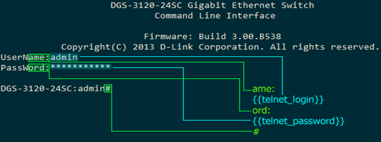
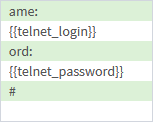
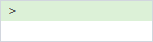

!!! success "Key note"
    To obtain configuration from node, cBackup must go through authentication process, therefore we use combination of **credentials** and **authentication templates**.
    
# Credentials

Credential management is available via menu `Inventory -> Credentials`. Credentials is a named set of authentication data (logins, passwords, protocols, port numbers, etc) that is used in authentication processes. Credentials set can be assigned to any number of subnets and will be used in numerous cBackup processes.

### Tips and features

* You can hide/unhide passwords by clicking on the checkbox. No excessive fields for _"please repeat password again'_, but check your passwords twice.
* You can save credentials set and test it against certain IP-address. Fill the form on the right side and check if credentials are valid. 
    *  This form automatically adjusts depending on the set of credentials you've defined. E.g. if you didn't save _Telnet_ credentials, no telnet test will be performed. On the other hand, if you save _Telnet_ credentials, then you will be prompted to enter not only IP address, but also _Telnet username and password prompts_.
    * Later, if you are planning to use Telnet for communicating with your devices, you will have to define username and password prompts in [authentication sequences](authentication#authentication-templates)
* Test for _SNMP write_ is safe, no real OIDs are involved. We're trying to write to read-only OID, catching error code. Check the [source of CredentialTest.php](https://github.com/cBackup/core/blob/master/models/CredentialTest.php) if you have any doubts.

### SNMP

SNMP protocol is used in discovery process - i.e. in finding new nodes and gathering such information as sys.name, sys.location, sys.contact, network interfaces and so on. At this moment only SNMP v1 and v2/v2c are supported, 3d version is coming in next major release. Also you can use SNMP protocol for saving configuration or for any other custom tasks, in this case most likely you'll need to store _snmp set community_, otherwise it's enough to store _readonly community_.

### Telnet and SSH

Telnet and SSH protocols are used in obtaining text configuration data from nodes. Also you can use these protocols for custom tasks, defining commands to send to the node.

------------

# Authentication templates

Authentication templates are located under `Inventory -> Device auth templates` menu. Authentication template is a named sequence of prompts and responses representing authentication sequence for communication via Telnet. Every template can be assigned to any existing [device](devices). There're several macros available (i.e. `{{telnet_login}}`, `{{telnet_password}}`, `{{enable_password}}`) representing corresponding data from predefined **credentials** (see above).
 
!!! note
     For communication via SSH all macros will be ignored and initial SSH login and password are retrieved from credentials directly. Rest of the sequence is still used to send privileged mode password if it's required.

In all auth sequences on green fields there're command line prompts, and on the white fields - commands cBackup is sending to the node, trying to go through authentication process. Here are some authentication sequences:

Description | Template
------------ | -------------
Cisco CLI with privileged mode password prompt (enable password). If your node wants SSH authentication, the `{{telnet*}}` macros will be ignored and the first active entry from sequence is the prompt |  
Switch authentication sequence (Zyxel, D-Link). These switches primarily work via Telnet | 
MikroTik authentication sequence. Node works only via SSH, no telnet is involved, no privileged mode, therefore we wait only for CLI prompt | 
ZTE GPON OLT auth. Node works only via SSH, no telnet is involved, no privileged mode. As well as for MikroTik, all authentication entities (SSH login and password) are taken from **credentials set** (see chapter above) | 