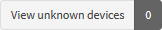
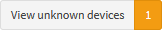
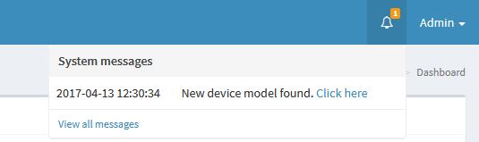
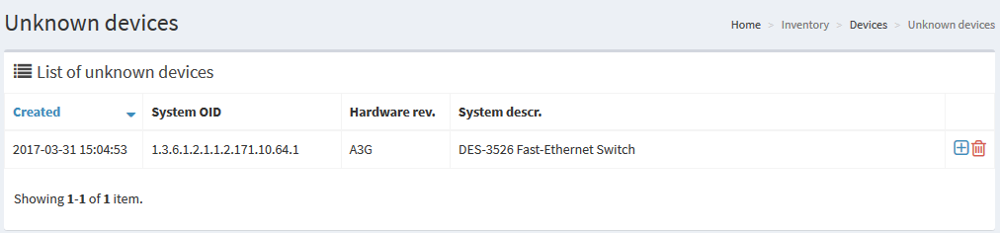
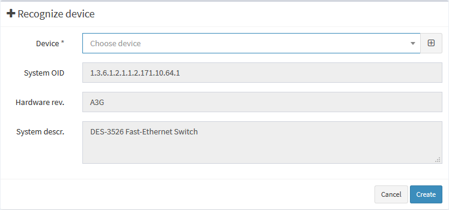
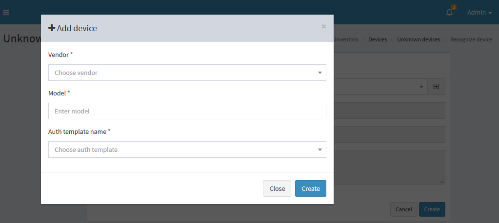
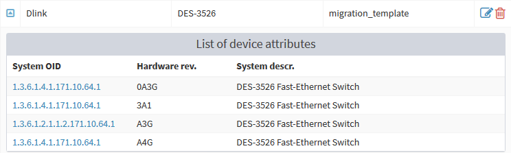

# Concept

Device management is available via menu `Inventory -> Devices`. There're two entites to be managed in terms of 'devices': _vendors_ and _device list_. When cBackup discovers new device that is not yet defined, it will be shown in the list of _unknown devices_. Check the top of the device list  if there are any unkonwn models found 

!!! cite "Notification"
    Every node involved in cBackup task processing hase to be attached to corresponding device defined in the list, whether you discover it or add manually. Homogeneous network is easier to manage than heterogeneal, but device definition has to be done in any case - all devices must be recognized and ascribed.

# Vendor management

Vendors are represented by flat single-entity list of predefined vendor names. It can be used in factory methods in Java daemon, or more likely, used only for grouping device models classificator.

# Device management

Generally, device is described with three fields: vendor name, model and authentication template. Also for all auto discovered nodes additional attribute(-s) of System OID must be defined. These attributes describe SNMP root OID as main device identifier depending on hardware revision. Only for manually added nodes (i.e. nodes which don't go through discovery process) System OID can be empty.

!!! note
    Please note, if you add device manually, devices with the same model will be found during [discovery](discovery) process as unknown device and you will be prompted to define System OID attribute. At the same time, manually added node with manually created device will be skipped during discovery process and its' information won't be refreshed. 

## Add discovered device

If cBackup has discovered an unknown device, you will be notified in the widget on the top right corner near your username dropdown: 
 

Or you can check the list of devices for the button . Anyway, proceeding to the message you'll see the corresponding entry. You can truncate it by pressing <i class="fa fa-trash-o"></i>, or proceed with _recognizing_ it to the list by clicking on <i class="fa fa-plus-square"></i> to assign new System OID to a device

Here you can assign found System OID property to any existing device by choosing it from dropdown select:

...or to create a new device by clicking on <i class="fa fa-plus-square"></i>

After you've added new System OID property to new or existing device, submitted data can be viewed in the grid:
 
 