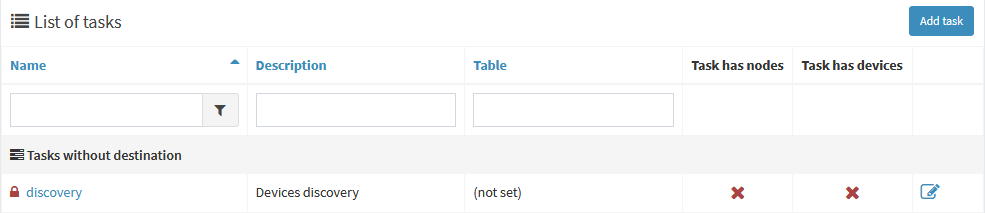
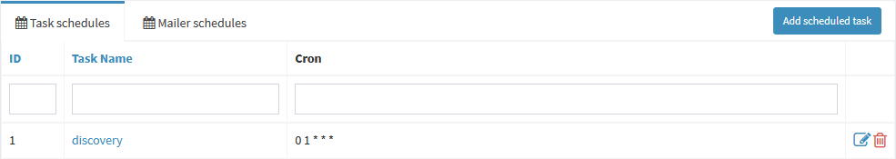
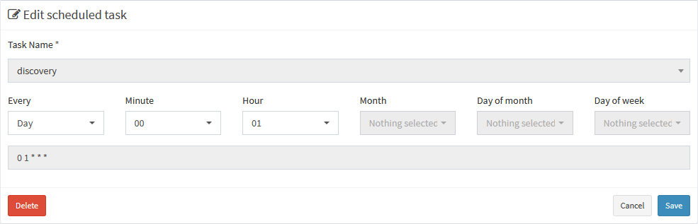

!!! cite
    Discovery - is a system scheduled task intended for finding nodes in predefined subnets and to update its' information via SNMP protocol. To use discovery you'll need at least valid SNMP readonly community defined in [credentials](authentication/#credentials) for [subnet](subnets) or [device](devices).
    
To work correctly, two entities must be defined:

1. **Task** 'discovery' in `Processes -> Tasks` (it's system-defined, thus can't be deleted and already exists upon install)    
2. **Schedule entry** in `Processes -> Schedules` for this task you want to define when it should be started 
  

# How it works

When both entries are configured, Java daemon at a set time will engage discovery task, processing defined networks in search of new or updated nodes. Any [excluded IP addresses](nodes/#exclusions) still will be discovered and saved to nodes list, but won't be processed by any other tasks, i.e. 'backup'. 