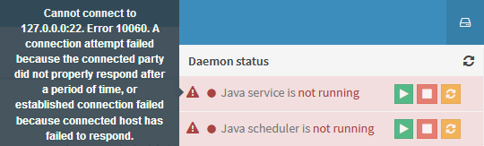

The top right corner of cBackup web interface is the notification area and quick access to logged user's account settings.

#### Left button...

...is the daemon control. You can start/stop/restart the daemon itself or perform similar actions on it's internal scheduler. Red background on a row means that web application was unable to establish connection to the socket. Either settings are wrong or something went wrong with the service itself. You may try to hover on the <i class="fa fa-exclamation-triangle text-danger"></i> red triangle to read the exception message. 

In normal operation mode for cBackup both services are running | Something is broken 
------------------------ | ----------------------------
 | 

#### Bell button...

...is the quick access to messages about new unknown equipment found durring discovery process. Review messages and [recognize newly found devices](devices/#add-discovered-device). When device will be added as recognized, acknowledge the entry in [messages interface](system-messages.md)

#### Username dropdown...

...provides access to signing out, personalization options and user credentials editing.
