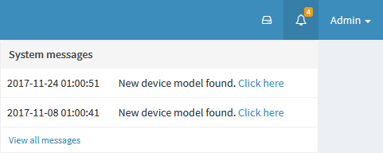

The top right corner of cBackup web interface is the notification area and quick access to logged user's account settings.

* **Left button** Is the daemon control. You can start/stop/restart the daemon itself or perform similar actions on it's internal scheduler. In normal operation mode for cBackup both services are running: 

  
* **Bell button** Is the quick access to messages about new unknown equipment found durring discovery process. Review messages and [recognize newly found devices](devices/#add-discovered-device). When device will be added as recognized, acknowledge the entry in [messages interface](system-messages.md) 

  
* **Username dropdown** Provides access to signing out, personalization options and user credentials editing.
