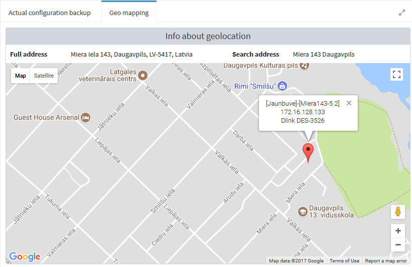

!!! note "Info"
    Geolocation plugin displays node location on Google map, depending on SNMP OID `system.SysLocation` and [system setting](../system-configuration/#system-settings) `Prepend location`
    
When plugin is installed, new tab `Geo mapping` is being added next to configuration backup tab. When data is obtained from Google Maps API, tab will contain map with actual node location, node model and IP-address.

As the name implies 'prepend location' prefix will be added before `system.SysLocation` OID data. If the vast majority of your nodes is located in one specific vicinity, you can define 'prepend location' in system configuration and this string will be prepended to every node's location. For all other nodes that require it - define prepend location data manually in the node editing interface. 

Also a new entry will appear in main menu as `Plugins -> Geo mapping`. There you'll see list of processed nodes with detailed information about geo coordinates, creation and modification time. If you need information about data retrieving process, click `View geolocation logs` on the top right side of the grid. Second button `Collect geolocations` initializes forced refresh of all geolocation data for all nodes. Also you can refresh each node data individually by clicking <i class="fa fa-refresh"></i> next to desired node.

You can schedule geolocation colleting via [scheduled tasks](../processes/#schedules) functionality, setting built-in task `geo_mapping`. This task is added to your cBackup automatically when you install the plugin.
