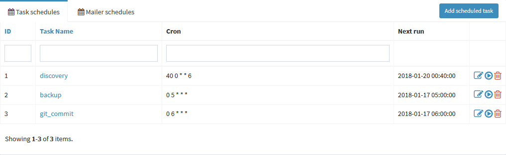

# Concept

# Global variables

Available under `Processes -> Global variables` menu, these variables can represent any predefined static property available in [jobs](#jobs). Global variable must be defined as `%%NAME%%` (you'll be notified if name is incorrect). And after creation it will become available in job editing interface on the right side as _Static variable_. Use it for configuring e.g. tftp server ip-address or any other data, you need to pass to command as part of any job.  

# Schedules

On the scheduled task list you may see two tabs for two schedule types: Tasks and Mail. The second one can be used to send regular reports about system state. And the first one can be called 'internal crontab' with appearance you may find familiar. To make things easier to comprehend, there's also a column 'Next run' with information when next sheduled task will be ckicked in:

Schedule is an entity, defining when particular task has to be executed and run. Generally you want to schedule every task to a particular time - do it wisely considering order and previous task execution time. Schedules are available under `Processes -> Schedules` menu and they look like a Linux crontab. However, a user friendly interface is provided:

