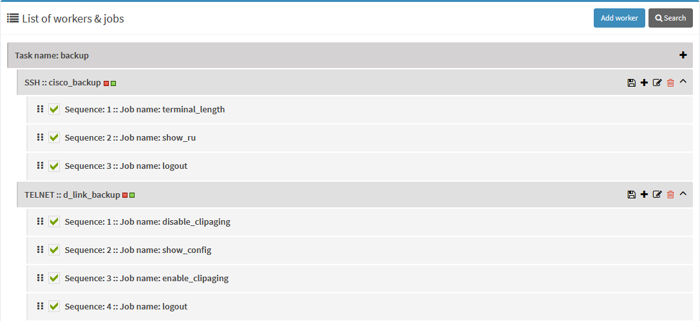
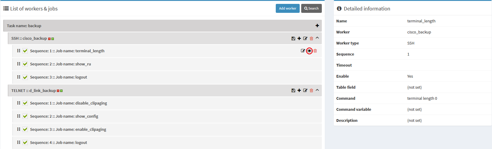
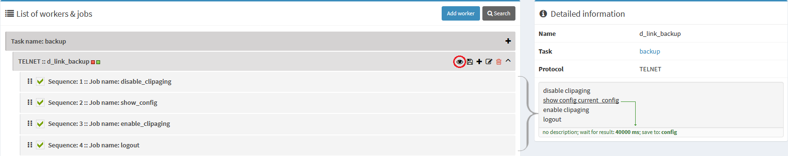

!!! cite 
    Jobs are sequences of commands being sent via SSH, Telnet or SNMP protocols. Workers are collections of jobs.

To understand the concept, keep in mind the chain: `Task <- Workers <- Jobs`

# Management

The image above demonstrates two workers for the `backup` task. You see worker protocol and its name separated by double semicolons. Next to the name there're two colored squares (hover mouse to view tooltip with explanation). The first one shows if there're any nodes assigned to this task, the second one shows if there're any devices assigned to the worker. By pressing <i class="fa fa-angle-down"></i> you can expand worker to view defined command sequences (jobs). Press on the <i class="fa fa-eye"></i> in job row to view details about the command:

Also you can <i class="fa fa-edit"></i> edit the job or the worker itself. Workers are described by name and protocol. Jobs have much more to be edited:

* Dragging by <i class="fa fa-ellipsis-v"></i> <i class="fa fa-ellipsis-v"></i> you can reorder jobs. Also you can reorder them in the editing popup.
* <i class="fa fa-check-square"></i> determine if sequence is active or not. Also in the editing popup there's a flag for job status.
* `SQL table name` field represents into what field of `out_*` table the result should be saved in.

    !!! note 
        Every worker should have at least one real SQL table field value set. Even if task destination is `File storage`, this value will be used as a key in file with stored data. If the worker doesn't have SQL table field, you'll see [corresponding warning with detailed description](../assets/worker3.png) how to fix the issue.

* `Timeout` represents value in milliseconds how long daemon will wait for result.
* `Command` for Telnet and SSH or `SNMP OID` for SNMP protocols represent what will be executed. For SNMP protocol you may also want to set `request type`.
* `Command variable` is a temporary variable (visible only within this particular worker), where the result of the request will be stored. You can call this variable in next sequences.
* For SNMP protocol if `SNMP request type` is `set`, you want to choose what to send to the node: data type (mandatory) and value (optional).

!!! success
    After you've finished editing worker and jobs in it, don't forget to <i class="fa fa-save"></i> save the worker.

# Job sequence information

Clicking on the <i class="fa fa-eye"></i> icon in the worker row you can get additional information about the job sequence within that worker. You'll see simplified commands for the protocol, specified for chosen worker. Clicking on the particular command will display information from that job: description, timeout, saving destination and local variable if any of these params are specified.   

