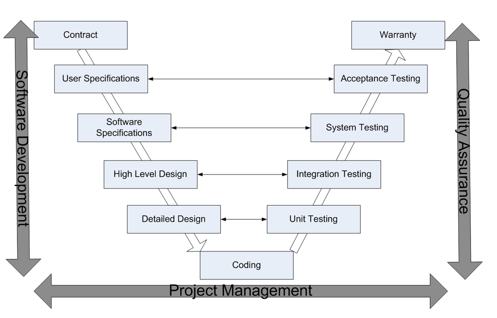

# What tests are available

We're using [Codeception](http://codeception.com/) testing suite, therefore there're 3 test types are available:

1. **Functional testing** 
This is a _verification_ activity; did we build a correctly working product? Does the software meet the business requirements? For this type of testing we have test cases that cover all the possible scenarios we can think of, even if that scenario is unlikely to exist "in the real world". When doing this type of testing, we aim for maximum code coverage trying to hit all edge cases (borderline cases) of all possible, impossible, proper and improper data.  
2. **Acceptance testing** 
This is a _validation_ activity; did we build the right thing? Is this what the customer really needs?  For this type of testing we use test cases that cover the typical scenarios under which we expect the software to be used. Also known as _black-box testing_, because we emulate human interaction.  
3. **Unit testing**  
This is a test for individual unit, such as a method in a class, with all dependencies mocked up. It tests an _independent unit of behavior_ - the smallest piece of the system that can be independently unit tested.

Test levels are easy to explain using V-model simpifying it to satisfy our needs:
