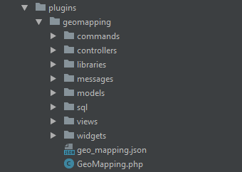
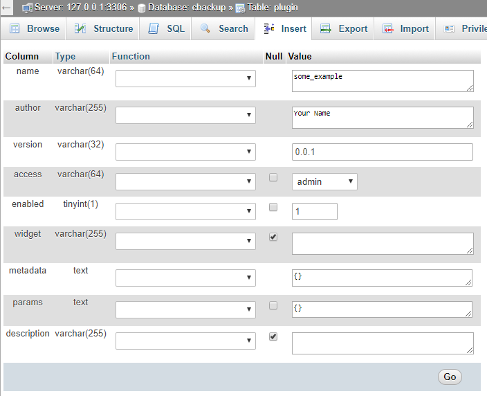
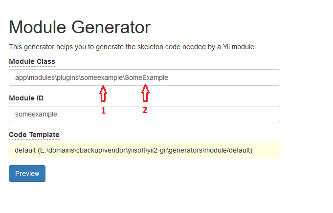
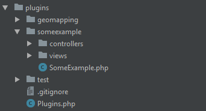
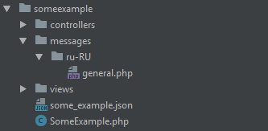

# Introduction

This guide is meant for users who want to help extend cBackup functionality. Our team created flexible plugin management system which allows users to add their own functionality to cBackup. Plugins in cBackup are represented by module `plugins` sub-modules. This approach ensures that developer has access to any existing cBackup functionality.

# Plugin structure

Functioning plugin relies on Yii2 module concept, therefore must be located in "modules/plugins" directory. When the development process comes to release stage, you want to export it as zip-archive. Zip archive filename must be equal to plugin directory name where every word is separated by underscore. E.g. plugin `geomapping` should be distributed in `geo_mapping.zip` file. 
 


Sample `geomapping` plugin directory structure is provided above. As you can see plugin is basically default Yii2 module except for some changes. Plugin root folder must contain json file with the same name as plugin directory. Every word in json filename must be separated with underscore, e.g. `geo_mapping.json`

Plugin base file name must be equal to plugin root directory name converted to camel case, e.g. `GeoMapping.php`. All database altering must be located in `sql` directory. Third party extensions if needed must be placed in directory `libraries`.

# Plugin JSON file structure

Plugin json consists from two parts: metadata and form description. Metadata is the information about plugin which is saved in `plugin` table in cBackup database upon the installation. Here is metadata example:

```json
{
  "metadata": {
    "name": "geo_mapping",
    "author": "cBackup Team",
    "copyright": "Copyright (C) 2017 cBackup Team. All rights reserved.",
    "license": "GNU Affero General Public License (AGPLv3)",
    "authorName": "Imants Cernovs",
    "authorEmail": "cernovs.imants@gmail.com",
    "authorUrl": "www.cbackup.me",
    "version": "1.0.0",
    "compatibility": "0.0.1",
    "description": "Plugin for node geolocation via Google Maps",
    "widget": "node"
  }
}
```

Mandatory fields are: 
* **name**: plugin name, must be the same as plugin .zip filename. E.g. if your plugin is distributed in `geo_mapping.zip`, then `name` parameter must be `geo_mapping`, otherwise installation will fail;
* **author**: person or organization who created plugin;
* **version**: plugin version. We use [Semantic Versioning](http://semver.org/) for cBackup and recommend stick with it in plugins; 
* **compatibility**: minimal cBackup version suitable for your plugin;
* **description**: brief plugin description

If your plugin has a widget, you can set extra parameter `"widget": "node"`, and your widget will be rendered in node view. For now, we support only node widgets. In the upcoming releases we are going to add more binding points for plugins.

## Plugin form 

If your plugin needs some dynamic settings to be adjusted by user, you can specify them in plugin form. Later this form will be rendered in plugin management view. Here is form object in plugin JSON file where settings are split by tabs:

```json
{
  "form" : {
    "tabName1": {
      "fields" : []
    },
    "tabName2": {
      "fields" : []
    },
    "tabName3": {
      "fields" : []
    }
  }
}
```

### Text input

```json
{
  "type": "textInput",
  "label": "Test Input",
  "name": "test_1_input",
  "default": "123",
  "description": "Add some description if needed",
  "options": {
    "class": "form-control",
    "required": true,
    "pattern": "[0-9]*",
    "minlength": "3"
  }
}
```

The JSON above will render simple text input. Where `"options"` are any valid text input tag HTML attributes. See [documentation](https://www.w3schools.com/tags/tag_input.asp) for more information. 

### Drop down select

```json
{
  "type": "dropDownList",
  "label": "Test dropdownlist",
  "name": "test_2_input",
  "default": "0",
  "description": "Add some description if needed",
  "options": {
    "class": "select2"
  },
  "values": {
      "0": "Option 1",
      "1": "Option 2"
  }
}
```

You can set input type by configuring "type" attribute, by default text attribute is set. But the code above will render dropdown select input. If you configure parameter as "select2", the dynamic Select2 dropdown will be rendered. Values can be translated if you add translation in plugin `general.php` file. In the same way as for text input, `options` [any valid html select attributes](https://www.w3schools.com/tags/tag_select.asp).

### Bootstrap toggle

```json
{
  "type": "toggle",
  "label": "Test checkbox toggle",
  "name": "test_3_input",
  "default": "0",
  "description": "Add some description if needed",
  "toggle": {
    "data-on": "Yes",
    "data-off": "No"
  },
  "options": {
    "data-onstyle": "success",
    "data-offstyle": "danger",
    "uncheck": "0"
  }
}
```

The code above will render Bootstrap Toggle input. Please see [plugin documentation](http://www.bootstraptoggle.com/) for valid `options`. All plugin parameters can be passed via `options`. Please consider setting toggle text like in example above, otherwise text will not be translated.

### iCheck (checkbox)

```json
{
  "type": "checkbox",
  "label": "Test checkbox iCheck",
  "name": "test_4_input",
  "default": "1",
  "description": "Add some description if needed",
  "options": {
    "data-checkbox-class": "icheckbox_minimal-red",
    "uncheck": "0"
  }
}
```

The code above will render iCheck plugin checkbox. Please see [plugin documentation](http://icheck.fronteed.com/) for valid `options`. To change checkbox color you can set iCheck class like in example, if checkbox class is not set green checkbox will be rendered by default.

### Radio input

```json
{
  "type": "radioList",
  "label": "Test radio list",
  "name": "test_5_input",
  "default": "0",
  "description": "Add some description if needed",
  "values": {
    "0": "Option 1",
    "1": "Option 2",
    "2": "Option 2",
    "3": "Option 2"
  }
}
```

The code above will render Bootstrap radio button list. Options can be translated if you add translation in plugin `general.php` file. Valid `options` can be checked in the [official documentation](https://www.w3.org/wiki/HTML/Elements/input/radio)

### Textarea

```json
{
  "type": "textarea",
  "label": "Test textarea",
  "name": "test_6_input",
  "default": "This is some textarea",
  "description": "Add some description if needed",
  "options": {
    "class": "form-control",
    "style": "resize: vertical;",
    "required": true
  }
}
```

The code above will render text area. Valid `options` can be checked in the [official documentation](https://www.w3schools.com/tags/tag_textarea.asp).

## Widget configuration

If your plugin contains widget you must add following tab. The code below will allow user enable or disable plugin widget. You can add extra fields if you need more parameters for your widget.

```json
{
  "widget": {
    "fields" : [
      {
        "type": "toggle",
        "label": "Enable widget",
        "name": "widget_enabled",
        "default": "0",
        "description": "Add some description if needed",
        "toggle": {
          "data-on": "Yes",
          "data-off": "No"
        },
        "options": {
          "data-onstyle": "success",
          "data-offstyle": "danger",
          "uncheck": "0"
        }
      }
    ]
  }
}
```

# Plugin base file

Plugin base file is regular Yii2 module base file with some modifications. Let have a look at Geo Mapping plugin base file.

```php
<?php

namespace app\modules\plugins\geomapping;

use yii\base\Module;
use yii\console\Application;
use app\traits\PluginTrait;

/**
 * geomapping module definition class
 */
class GeoMapping extends Module
{

    /**
     * Add necessary functionality to plugin
     */
    use PluginTrait;

    /**
     * @inheritdoc
     */
    public $controllerNamespace = 'app\modules\plugins\geomapping\controllers';

    /**
     * @inheritdoc
     */
    public $defaultRoute = 'geo';

   /**
    * Add user custom translation files
    * @var array
    */
    public $translations = ['custom_translate'];

    /**
     * @inheritdoc
     */
    public function init()
    {
        parent::init();
        $this->initPlugin();
        require_once(__DIR__  . '/libraries/vendor/autoload.php');

        /** Change controller namespace to access commands */
        if (\Yii::$app instanceof Application && $this->params['plugin_enabled'] == 1) {
            $this->controllerNamespace = 'app\modules\plugins\geomapping\commands';
        }

    }

}
```

This file can be generated using Yii2 built in scaffolding tool Gii. To add to module all necessary functionality you must register trait from `app\traits\PluginTrait` and to call its' initializing method as `$this->initPlugin()` (see example above). Plugin Geo Mapping is using third party extensions so we must register autoload.php as PSR-4 suggests. 

# Adding plugin tables to database

To add your custom tables to cBackup you want to create table installation file in plugin `sql` directory. Files' name must be equal to your plugin name with all words are in camel case and must end with word `Tables`. E.g. if your plugin name is `geo_mapping` then table installation file name must be `GeoMappingTables.php`

```php
<?php

namespace app\modules\plugins\geomapping\sql;

use app\components\PluginTableInstaller;

/**
 * Class GeoMappingTables
 *
 * @package app\modules\plugins\geomapping\sql
 */
class GeoMappingTables extends PluginTableInstaller
{

    /**
     * @inheritdoc
     */
    public function install()
    {
        $this->command->createTable('{{%plg_geomapping_geolocation}}', [
            'id'           => $this->integer(11)->notNull().' AUTO_INCREMENT',
            'node_id'      => $this->integer(11)->notNull(),
            'last_query'   => $this->string(255)->notNull(),
            'full_address' => $this->string(255)->notNull(),
            'address_data' => $this->text()->notNull(),
            'latitude'     => $this->decimal(10, 8)->notNull(),
            'longitude'    => $this->decimal(11, 8)->notNull(),
            'created'      => $this->timestamp()->notNull()->defaultExpression('CURRENT_TIMESTAMP'),
            'modified'     => $this->timestamp()->defaultValue(null),
            'PRIMARY KEY (`id`)'
        ])->execute();


        $this->command->addForeignKey('fk_plg_geomapping_geolocation1', '{{%plg_geomapping_geolocation}}',
        'node_id', '{{%node}}', 'id', 'CASCADE', 'CASCADE')->execute();

        $this->command->createIndex('node_id_UNIQUE', '{{%plg_geomapping_geolocation}}', 'node_id', true)
	->execute();

        return true;
    }

    /**
     * @inheritdoc
     */
    public function update()
    {
        return true;
    }

    /**
     * @inheritdoc
     */
    public function remove()
    {
        $this->command->dropTable('{{%plg_geomapping_geolocation}}')->execute();
        return true;
    }

}
``` 

Table class must extend abstract `PluginTableInstaller` class. All plugin tables must be prepended with `plg_` prefix and table name must contain plugin name. Table name format: `prefix_pluginname_tablename`, for example `plg_geomapping_geolocation`. Database table names have to be singular E.g. `plg_geomapping_geolocation`, ` plg_geomapping_log `. Only many-to-many relation tables can be plural. M2M table should be named e.g. `plg_geomapping_geo_has_nodes`. **We do not allow modify cBackup core tables!**

# Plugin widgets

We allow developers implementing widgets which later can be placed in node view page. At this moment, it is only possible to place widgets in node view page. Basically plugin widgets are standard Yii2 widgets with some modifications. You must create two public variables `$node_id` and `$plugin`. In widget `init()` method you must assign `$this->plugin` variable to plugin object using  `\Yii::$app->getModule('plugins/yourpluginname');`. The example of the widget is shown below: 

```php
<?php

namespace app\modules\plugins\geomapping\widgets;

use yii\base\Widget;
use app\models\Node;
use app\modules\plugins\geomapping\models\Geolocation;

/**
 * Class GeoMappingWidget
 *
 * @package app\modules\plugins\geomapping\widgets
 */
class GeoMappingWidget extends Widget
{

    /**
     * @var int
     */
    public $node_id;

    /**
     * Plugin context
     *
     * @var object
     */
    public $plugin;

    /**
     * @var array
     */
    public $data = [];

    /**
     * Prepare dataset
     *
     * @return void
     */
    public function init()
    {
        /** Access plugin data */
        $this->plugin = \Yii::$app->getModule('plugins/geomapping');
        $this->data   = Geolocation::find()->where(['node_id' => $this->node_id])->one();
    }

    /**
     * Render geo mapping view
     *
     * @return string
     */
    public function run()
    {
        return $this->render('geo_mapping_widget', [
            'plugin'  => $this->plugin,
            'node_id' => $this->node_id,
            'data'    => $this->data,
        ]);
    }

}
```

# Accessing plugin parameters and translations

You can access all plugin parameters. Here are some examples how to access plugin parameters from specific location.

1. Access to plugin parameters from model
    1. all parameters - `Yii::$app->controller->module->params;`
    2. specific parameter - `Yii::$app->controller->module->params[‘key’];`
    3. translations - `Yii::$app->controller->module::t(‘general’, ‘Test’);`
2. Access to plugin parameters from controller
    1. all parameters - `$this->module->params['plugin access'];`
    2. specific parameter - `$this->module->params['plugin access'];`
    3. translations - `$this->module::t('general', ’Test’);`
3. Access to plugin parameters from view
    1. all parameters - `$this->context->module->params['plugin_access'];`
    2. specific parameter - `$this->context->module ->params['plugin_access'];`
    3. translations - `$this->context->module::t('general', ’Test’);`

# Creating plugin basic structure

In this example we will create plugin skeleton to better understand plugin creating procedure. So let’s start. We will call our plugin some_example. First we must add entry to plugins table open phpMyAdmin and locate plugins table. See example below.



During the development you can add params and later use them in your code. After you have finished plugin development move all your created params to installation json file. See json creating file example.

Then we must create plugin skeleton using Yii2 Gii code generator tool `http://localhost/index.php?r=gii` and choose _Module generator_.



1. Plugin name without underscore
2. Plugin name in camel case without underscore

After generating module run `yii cache/flush-all` from CLI. In your project you must see something like this:



But at this moment plugin is not working correctly if you try to open it you will see exception. We need to modify plugin base file. Let’s open base file and register PluginTrait. Your base file must look something like this:

```php
<?php

namespace app\modules\plugins\someexample;

use app\traits\PluginTrait;

/**
 * someexample module definition class
 */
class SomeExample extends \yii\base\Module
{
    use PluginTrait;

    /**
     * @inheritdoc
     */
    public $controllerNamespace = 'app\modules\plugins\someexample\controllers';

    /**
     * @inheritdoc
     */
    public function init()
    {
        parent::init();
        $this->initPlugin();
    }
}
```

Now our new plugin is working. Let’s add all remaining plugin files and directories:



As you can see we've created `messages` directory with translation for Russian language, and `some_example.json` where plugin metadata and management form information will be stored. Please see this document for detailed explanation about JSON file structure.

At this point you can start developing plugin as standard Yii2 module. You can access all cBackup method by using namespaces. If your plugin needs custom tables, please see this document on how to create custom plugin tables. To run sql install/remove method create following action in your controller and run this action.

```php
<?php

public function actionRunSql($action)
{
    $sql       = new \app\modules\plugins\someexample\sql\SomeExampleTables();
    $do_action = ($action == 0) ? $install = $sql->install() : $sql->remove();
    return $do_action;
}
```
In your browser run `http://localhost/index.php?r=plugins%2Fsomeexample%2Fdefault/run-sql&action=your_action` and set `action` param to `0` for install or to `1` for delete. After development delete this method.

If your plugin has tables, you must generate models using Yii2 Gii tool. In model generator tool, set namespace to location where your plugin is located for example `app\modules\plugins\someexample\models`. This will create models in your plugin directory. Also check `Use Table Prefix` checkbox. 

After you have finished creating plugin and created proper installation json file you can create zip file with your plugin name. In this case it will be `some_example.zip`.  Before installation delete your plugin via cBackup plugin management user interface. If you need more complicated example, please feel free taking any existing plugins from cBackup bundle as an example and base.
