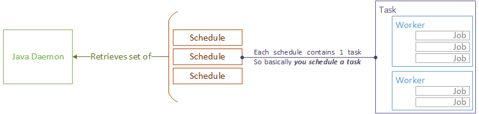

# Concept

cBackup utilizes SNMP, Telnet and SSH protocols to communitcate with devices and to retrieve data from nodes. SNMP is used for node discovery and polling processes. It is possible to use only Telnet or SSH to backup nodes, but SNMP provides more verbose data for node management.

cBackup itself consists of two parts: **web interface** and **daemon**. Web interface is written in PHP on top of [Yii2 framework](http://www.yiiframework.com) and daemon is a Java Spring application running as system service. Daemon communicates with cBackup web core via REST API (via HTTP protocol), so theoretically it can be run in the separate environment. 

# Key terms

_Term_ | _Definition_
------------ | -------------
Node | End unit of network equipment, a subject to configuration backup process. Most often **nodes** are represented by switches and routers of different classes.
Device | Class or group of network equipment described in terms of vendor and model. To each device there's an **authentication template** assigned. 
Authentication template | Sequence of prompts and responses representing authentication sequence for communication via Telnet. Every template can be assigned to any **device**. There're several macros available (e.g. {{telnet_login}}, {{telnet_password}}) representing corresponding data from **credentials**.  
**⚠ Warning!** For communication via SSH all macros will be ignored and initial SSH login and password are retrieved from credentials directly. Rest of the sequence is still used to send privileged mode password if it's required. See [authentiaction documentation](../administrators-guide/authentication) for full information.

Network | Simple subnet of any class, defined in CIDR format. To each subnet particular **credentials** are assigned. 
Credentials | Set of authentication data (logins, passwords, protocols, port numbers, etc) that is used in authentication processes. Credentials set can be assigned to any number of subnets and will be used in numerous cBackup processes.
Discovery | Process of checking nodes in all defined networks. New nodes are discovered, existing are being checked for updates (e.g. if equipment model has been changed) 
Daemon | cBackup main daemon with internal scheduler. Physically it's executable .JAR file. It handles processes of discovery, polling and required configuration data retrieving. Communicates with cBackup web core via REST API.
Schedule | cBackup doesn't rely on system cron and utilizes its' own scheduler. You can schedule system tasks or reporting via email. Each schedule represents one task, so in other words _you schedule a task_.
Task | Particular task itself that could be assigned to nodes or devices. Task consists of **workers**.
Worker | Set of commands intended for specific functionality processing. Primarily worker is described by protocol and consists of **jobs' sequence**
Job | Specific command (Telnet or SSH depending on **worker's** protocol). Also can be SNMP OID if worker, which contains this job works over SNMP protocol. 

# Process components

For process components relations comprehension the following diagram can be used:

